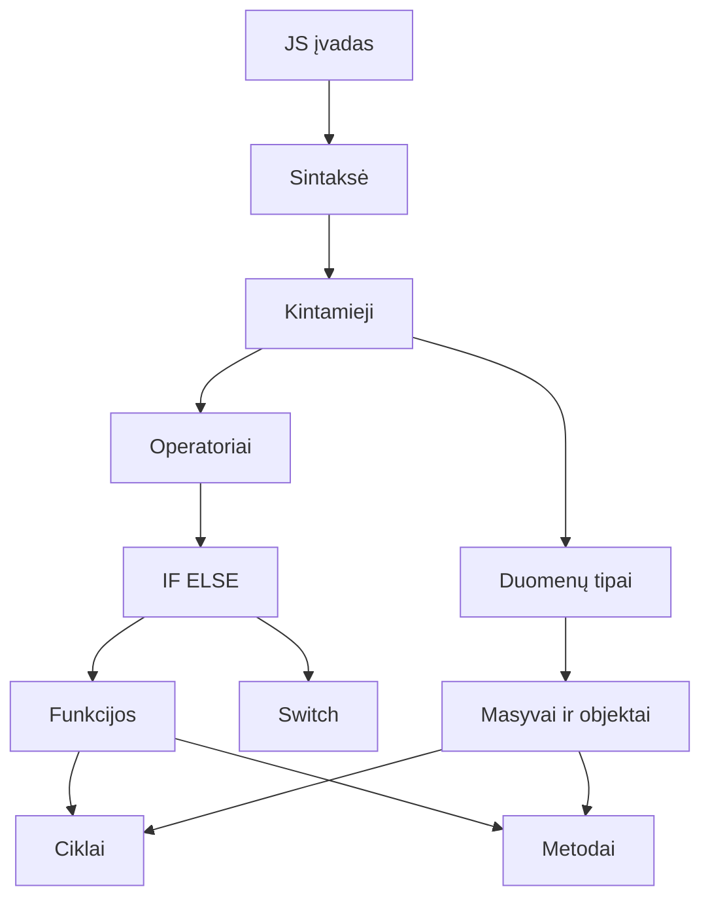

# Grafo žemėlapis

#js #map

Šitas puslapis padeda pamatyti, kaip temos susijusios.

```mermaid
graph TD
    A[JS įvadas] --> B[Sintaksė]
    B --> C[Kintamieji]
    C --> D[Duomenų tipai]
    D --> E[Masyvai ir objektai]
    C --> F[Operatoriai]
    F --> G[IF ELSE]
    G --> H[Switch]
    G --> I[Funkcijos]
    I --> J[Ciklai]
    E --> J
    I --> K[Metodai]
    E --> K
```

Obsidian Graph View ryšius sukurs automatiškai iš `[[vidinių nuorodų]]`.

Grįžti:
- [[00_START_CIA]]
